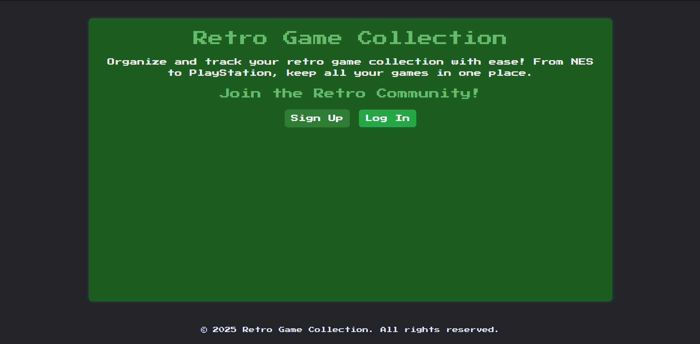
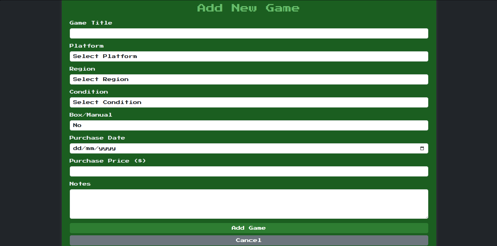
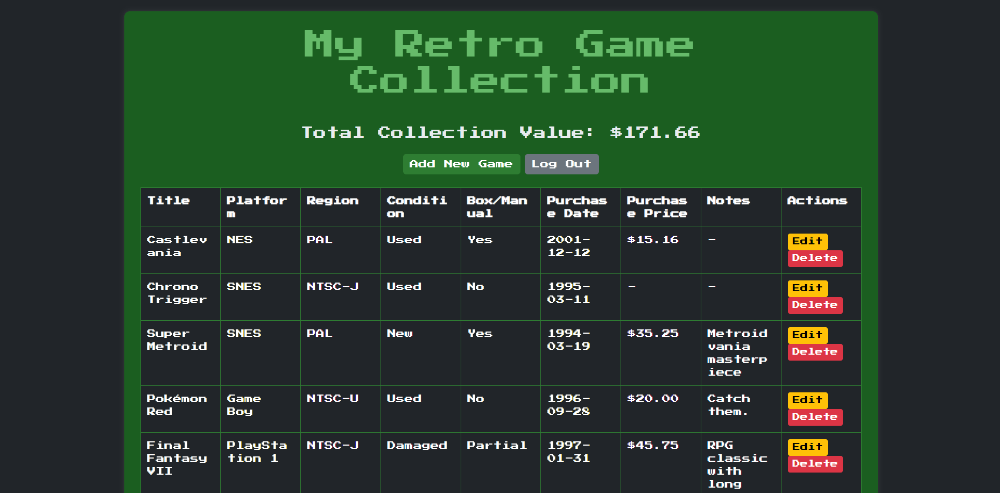

# Retro Oyun Koleksiyonu

Retro Oyun Koleksiyonu'na hoş geldiniz! Bu web uygulaması, retro oyun tutkunlarının koleksiyonlarını düzenlemelerine ve takip etmelerine yardımcı olmak için tasarlanmıştır. PHP, Bootstrap ve MySQL veritabanı kullanılarak geliştirilen bu proje, oyunlarınızı eklemenize, düzenlemenize ve silmenize olanak tanıyan sezgisel bir arayüz sunar.

## Özellikler
- Başlık, platform, bölge, durum, satın alma tarihi, fiyat ve notlar gibi detaylarla yeni oyun ekleme.
- Mevcut oyunları düzenleme veya silme.
- Koleksiyonunuzun toplam değerini görüntüleme.
- Aydınlık ve karanlık tema desteğiyle duyarlı tasarım.
- Dinamik kullanıcı kimlik doğrulama sistemi ile giriş ve çıkış yapma.
- Platform, bölge ve durum için özelleştirilebilir "Diğer" seçenekleri.
- Oyun tablosunda uzun notlar için metin sarma özelliği.

## Erişim
Bu uygulamaya şu adresten erişebilirsiniz: [http://95.130.171.20/~st23360859718/](http://95.130.171.20/~st23360859718/).  
- Siteye giriş yaparak koleksiyonunuzu hemen yönetmeye başlayabilirsiniz.
- Yeni bir kullanıcı kaydı oluşturabilir veya mevcut kimlik bilgilerinizle oturum açabilirsiniz.

## Kullanım
1. **Giriş Yapma**: `login.php` sayfasına giderek oturum açın.
2. **Oyun Ekleme**: `add_game.php` sayfasına giderek oyun detaylarını girin (başlık, platform, bölge, durum, satın alma tarihi, fiyat ve notlar).
3. **Koleksiyonu Görüntüleme**: Ana sayfadaki "Koleksiyonunu Görüntüle" butonuna tıklayarak `games.php` sayfasında oyunlarınızı ve toplam değeri görün.
4. **Düzenleme/Silme**: Tablodaki "Düzenle" ve "Sil" butonlarını kullanarak oyunları yönetin.
5. **Çıkış Yapma**: Ana sayfadan veya oyunlar sayfasından çıkış yapın.

## Ekran Görüntüleri
Projenin kullanım akışını gösteren bir ekran görüntüsü serisi:
- **Ana Sayfa**: Kullanıcı girişi yaptıktan sonra "Hoş geldin, [kullanıcı_adı]!" mesajı ve koleksiyon butonu görünümü.  
  
- **Oyun Ekleme Formu**: Oyun ekleme sayfasında formun doldurulmuş hali ve doğrulama hataları (örneğin, geçersiz tarih).  
  
- **Oyun Tablosu**: Oyunların listelendiği tablo, uzun notların sarılmış hali ve toplam değer.  
  

## Video
[Video Linki](https://youtu.be/Ien6nIv1bRg)

## Bilinen Sorunlar ve Çözümler
- **Tablo Taşması**: `table-responsive` ve `max-width` ile çözüldü.
- **Metin Sarma**: Uzun notlar satırlara bölünmektedir.

## Katkıda Bulunma
1. Repoyu çatallayın (fork).
2. Yeni bir dal oluşturun (`git checkout -b ozellik-dali`).
3. Değişikliklerinizi yapın ve commit edin (`git commit -m "Değişiklik açıklaması"`).
4. Değişiklikleri itin (`git push origin ozellik-dali`).
5. Bir çekme isteği (pull request) gönderin.

## Lisans
Bu proje MIT Lisansı ile lisanslanmıştır - detaylar için [LICENSE.md](LICENSE.md) dosyasını inceleyin.
